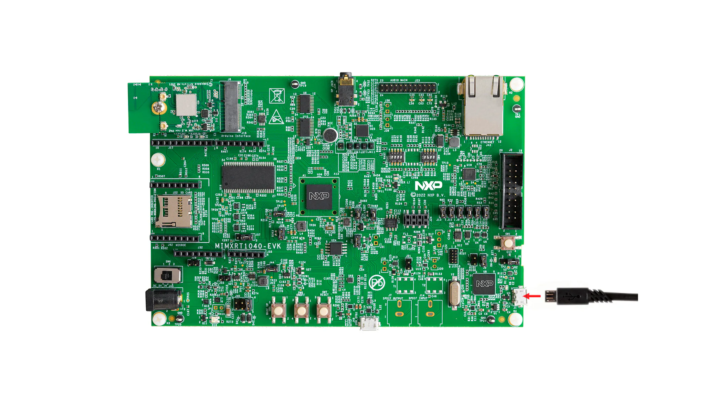

# i.MX RT1040 Driver Exploration

This repository contains hands-on experiments and examples using **NXP i.MX RT1040 drivers**.
The goal is to **learn, document, and share** practical usage of the SDK drivers by building
small, focused examples around real peripherals.

Rather than providing generic boilerplate code, this repo focuses on **understanding how things actually work**, why certain configurations are needed, and how peripherals interact together.

  

---

## 🎯 Objectives

- Explore i.MX RT1040 peripherals through real examples
- Understand driver configuration and internal behavior
- Document lessons learned during development
- Provide reusable reference code for future projects

---

## 🚀 Current Content

### ✅ ADC with DMA
- ADC configuration using NXP SDK
- DMA setup for automatic ADC data transfer
- Non-cacheable and aligned buffers
- Continuous sampling without CPU intervention
- Practical example showing how ADC + DMA work together

---

## 🧰 Platform & Tools

- **MCU**: NXP i.MX RT1040
- **SDK**: NXP MCUXpresso SDK
- **Language**: C
- **IDE**: MCUXpresso IDE (but code is IDE-agnostic)

---
